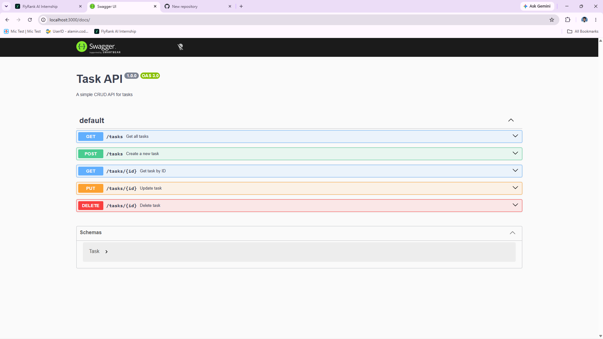

# Todo API

A simple RESTful CRUD API for managing tasks, built with Node.js and Express.js.

## Features

* Create, read, update, and delete tasks
* Request validation
* Proper HTTP status codes
* OpenAPI/Swagger documentation

## Tech Stack

Node.js | Express.js | OpenAPI | Swagger UI

## Getting Started

### Installation

```bash
npm install

```

### Run

```bash
node app.js

```

### Base URL

```text
http://localhost:3000

```

## API Endpoints

| Method | Endpoint | Description |
|--------|----------|-------------|
| **GET** | `/tasks` | Get all tasks |
| **GET** | `/tasks?search=keyword` | Search tasks by title |
| **GET** | `/tasks?done=true` | Filter by completion status (true/false) |
| **GET** | `/tasks?search=keyword&done=false` | Search AND filter combined |
| **GET** | `/tasks/:id` | Get a single task by ID |
| **POST** | `/tasks` | Create a new task (send `{"title": "..."}`) |
| **PUT** | `/tasks/:id` | Update a task (send `{"title": "...", "done": true}`) |
| **DELETE** | `/tasks/:id` | Delete a task |
| **GET** | `/stats` | Get task statistics (`total`, `done`, `open`) |
| **POST** | `/reset` | Reset to the 3 initial example tasks |
| **GET** | `/health` | Health check (`{"status": "ok"}`) |
| **GET** | `/` | API information |

### Status Codes

`200 OK` · `201 Created` · `204 No Content` · `400 Bad Request` · `404 Not Found`

## Example Request & Output

```bash
curl -i http://localhost:3000/tasks

```

Paste the actual output from your working API below:

```text
PASTE YOUR ACTUAL OUTPUT HERE

```

## Swagger UI

Access the interactive documentation:

```text
http://localhost:3000/docs

```

Example: 




## Optional
### The Mortality Experiment

I tested what happens when the server restarts:

1. Started the server and added 3 new tasks
2. Verified they appeared in `GET /tasks`
3. Stopped the server with `Ctrl+C`
4. Restarted the server
5. Ran `GET /tasks` again — the new tasks were gone!

**What happened:** The tasks were stored in memory (RAM), which is wiped clean when the server process ends. Only the hard-coded initial tasks remained.

**Why this matters:** Real applications need persistent storage. In Week 3, we'll add a database so data survives server restarts — this is the entire reason Week 3 exists.


## AI vs Me — Stage 7 Bonus

I prompted an AI to build the same CRUD API. Here's what I found:

### First Attempt (saved in `ai-version/`)
The AI followed all functional requirements but restructured my project:

| **My Structure** | **AI's Structure** |
|------------------|-------------------|
| `app.js` (all code) | `app.js` + `data/db.js` + `routes/tasks.js` |
| `openapi.json` | `swagger/swaggerSpec.js` |
| Single file | Multiple folders and files |

**What the AI got right:** All endpoints, status codes, validation, Swagger, search/filter, stats, reset — everything worked functionally.

**What the AI got wrong (for me):** It changed my file structure and replaced `openapi.json` with `swaggerSpec.js`.

**What I forgot to specify:** "Keep my exact file structure: package.json, app.js, openapi.json — no extra folders."

### My Original Prompt:
I want to build a Todo API using Node.js and Express on port 3000. The root endpoint (`/`) with a GET request should return an object containing three fields: the app name, version, and available endpoints. For server health checks, the `/health` endpoint should return a JSON object with status `"ok"`.
I plan to use an in-memory database — an array of objects — where each task has `id`, `title`, and `done` (boolean). I need five initial endpoints: `GET /tasks`, `POST /tasks`, `GET /tasks/:id`, `PUT /tasks/:id` (for editing), and `DELETE /tasks/:id`. Each endpoint should handle errors properly, including returning a 404 status when a task is not found.
Additionally, I want to integrate Swagger UI to provide a clean, visual interface for testing all five API endpoints. I would also like to add query parameter support for filtering tasks by `search` and `done` status. Finally, include a `/stats` endpoint that returns task counts, and a `/reset` endpoint that restores the in-memory database to its initial state.

### The Rematch
I added structural requirements to my second prompt. The AI generated a version with my original single-file structure while keeping all functionality intact.

**What changed:** The AI now matches my exact file structure — all code in `app.js` with `openapi.json` for Swagger.

## Author

**Md Alamin**

Built as part of the FlyRank AI Fluency Program.